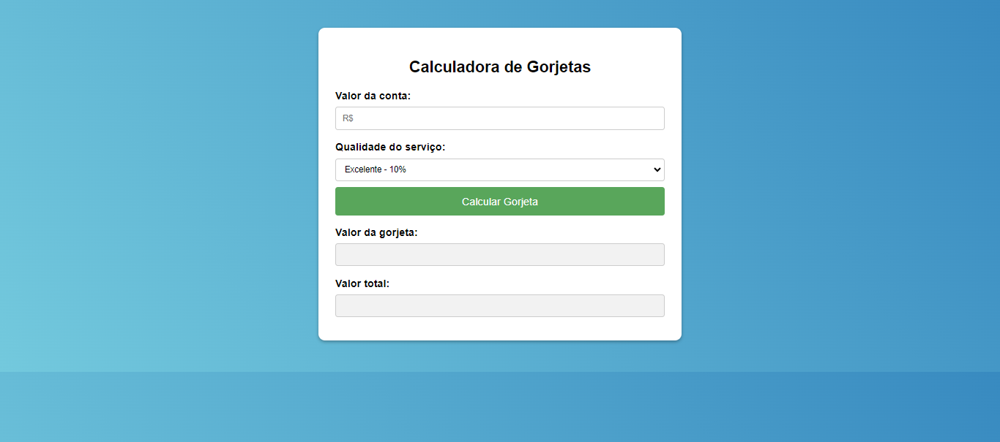

# 🚀 Calculadora de Gorjetas

## 🔧 Calcule gorjetas de forma rápida e fácil!

Neste projeto de JavaScript, desenvolvemos uma aplicação para calcular gorjetas de forma simples e eficiente. Com esta ferramenta, você poderá calcular a gorjeta adequada com base no valor da conta e na qualidade do atendimento.

## Tecnologias Utilizadas

- HTML
- CSS
- JavaScript

  

